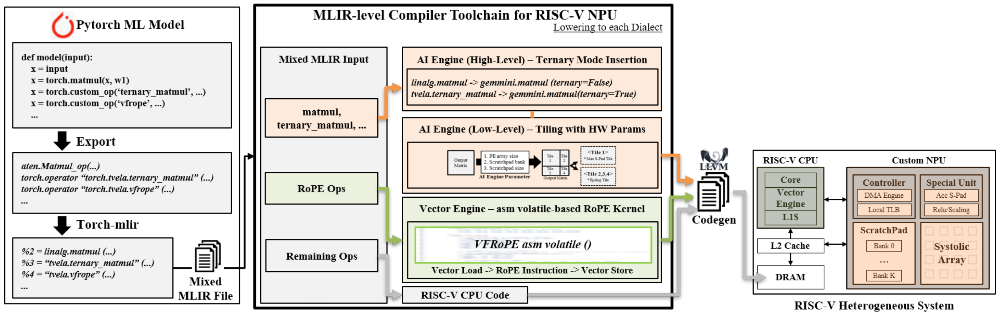
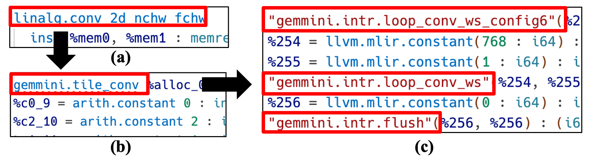

# T-Vela Project

## What is T-Vela

The T-Vela Project aims to develop a compiler toolchain and optimization techniques for efficiently running PyTorch models on RISC-V based systems.
Through MLIR-based IR transformation and optimization, models are converted into target hardware-friendly forms, and optimized binaries are generated by reflecting the specifications of the target AI engine.



## Dependencies

### Installing Conda and Chipyard

T-Vela is built on top of the Chipyard project for the verification environment.
Installing Chipyard is required for verification.

- Conda installation

```bash
conda create -y -n py37 python=3.7 -c conda-forge
conda activate py37
conda install -y -c conda-forge "conda-lock<2" "pydantic<2"
```

- Chipyard installation

```bash
git clone git@github.com:riscv-vela/t-vela.git && cd t-vela
./build-setup.sh
source env.sh
```

## T-Vela Installation

T-Vela is located in toolchains/mlir-tools and requires an LLVM dependency.

- Build and Test LLVM/MLIR/CLANG

```bash
cd toolchains/mlir-tools
mkdir llvm/build
cd llvm/build
cmake -G Ninja ../llvm \
    -DLLVM_ENABLE_PROJECTS="mlir;clang" \
    -DLLVM_TARGETS_TO_BUILD="host;RISCV" \
    -DLLVM_ENABLE_ASSERTIONS=ON \
    -DCMAKE_BUILD_TYPE=RELEASE
ninja check-mlir check-clang
```

- Build mlir-tools

If you have previously built the llvm-project, you can replace the $PWD with the path to the directory where you have successfully built the llvm-project.

```bash
cd toolchains/mlir-tools
mkdir build
cd build
cmake -G Ninja .. \
    -DMLIR_DIR=$PWD/../llvm/build/lib/cmake/mlir \
    -DLLVM_DIR=$PWD/../llvm/build/lib/cmake/llvm \
    -DLLVM_ENABLE_ASSERTIONS=ON \
    -DCMAKE_BUILD_TYPE=RELEASE
ninja
```

## Example and Results

- The figure below shows the lowering results for each dialect in MLIR.
- (a) shows the result of the LinAlg dialect, (b) shows the high-level lowering result for the target AI engine, and (c) shows the low-level lowering result for the target AI engine.


## Development Status

- Development of mapping functionality for machine learning models based on general-purpose ML frameworks
- Application of step-by-step dialect lowering and IR-level optimizations for AI models using MLIR
- Development of optimization passes considering hardware resources of the target AI engine
