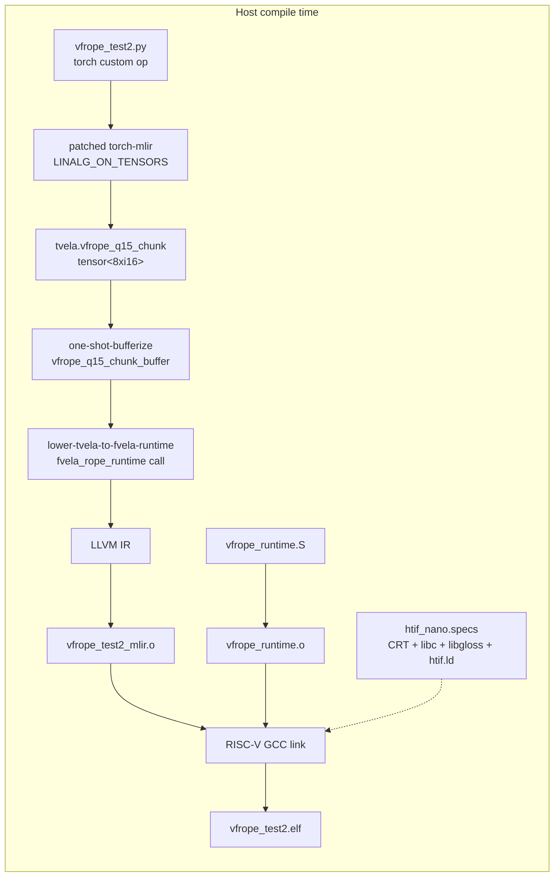
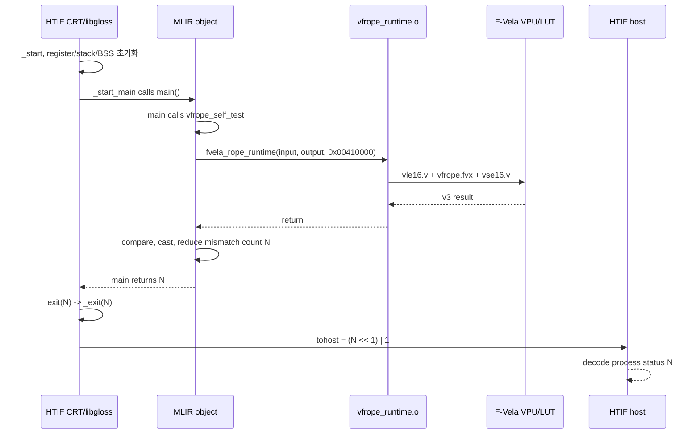

# F-Vela `vfrope` 구현 이해하기

이 문서는 `fvela-vpu-rope` 브랜치에 구현된 `vfrope_test2` MVP를 코드 기준으로 설명한다. 독자가 RoPE, 고정소수점, RISC-V vector 명령을 처음 접한다고 가정한다.

설명에서 참조하는 주요 코드는 다음과 같다.

- [PyTorch source](vfrope_test2.py)
- [Torch-MLIR T-Vela patch](../../../torch-mlir-vfrope/patches/0001-preserve-tvela-vfrope-in-linalg.patch)
- [T-Vela RoPE dialect](../../midend/include/Dialect/TVela/TVela.td)
- [T-Vela runtime lowering](../../midend/lib/Conversion/LowerTVelaToFVelaRuntime/LowerTVelaToFVelaRuntime.cpp)
- [Assembly runtime](vfrope_runtime.S)
- [ELF build rules](Makefile)
- [F-Vela RoPE hardware](../../../../f-vela/src/main/scala/f_vela_saturn/exu/CustomRoPEUnit.scala)
- [LUT generator](../../../../f-vela/software/test/rv_rope_test/make_lut.py)
- [Python golden model](../../../../f-vela/software/test/rv_rope_test/rope_gd.py)

## 현재 상태와 범위

이 통합은 일반적인 PyTorch RoPE subgraph를 자동으로 찾아 바꾸는 compiler가
아니다. Python model이 `tvela::vfrope_q15_chunk` custom op를 명시적으로 호출하고,
patched torch-mlir와 T-Vela가 그 의미를 hardware instruction 직전까지 보존한다.

`toolchains/torch-mlir-vfrope`는 현재 source-to-ELF 경로의 일부다. 이미 만들어진
ELF를 실행할 때는 필요 없지만 PyTorch source에서 MLIR이나 ELF를 다시 만들 때는
필수다. 제거된 standalone RAW converter는 같은 일을 하던 구 경로이며 더 이상
사용하지 않는다.

현재 계약은 세 범위를 구분해서 봐야 한다.

| 계층 | 현재 계약 |
|---|---|
| Compiler carrier | contiguous `tensor<8xi16>`, compile-time `m`/`idx` `0..65535` |
| Runtime ABI | `input`, `output`, `(m << 16) | idx`; default address space |
| Bit-exact self-test | `m=65`, `idx=0`, `VLEN>=128`, 현재 F-Vela RTL/LUT |

Compiler가 값을 받아들여 ELF에 넣는 것과 F-Vela에서 그 값의 수치 결과가 검증된
것은 다르다. 현재 Python eager body의 삼각함수 계수도 65/0에 고정돼 있다.

## 1. 전체 구조부터 보기

현재 build-time dependency는 다음과 같다. Python/MLIR 경로와 assembly runtime
경로가 서로 따로 object를 만든 뒤 최종 ELF link에서 합류한다.



여기서 software와 hardware의 경계가 중요하다.

| 구분 | 포함되는 것 |
|---|---|
| ELF software | 입력 데이터, `m`/`idx`, vector load/store, raw `vfrope` instruction |
| F-Vela hardware | custom instruction decoder, `RoPEUnit`, sin/cos LUT, Q1.15 계산 회로 |

코드 소유권도 다음처럼 나뉜다.

| 영역 | Source of truth | 역할 |
|---|---|---|
| Application | `example/fvela-vpu-rope/vfrope_test2.py` | custom op, 입력, 기댓값, `main` 생성 |
| Torch frontend | `toolchains/torch-mlir-vfrope` | opaque Torch op를 mixed Linalg/T-Vela IR로 변환 |
| T-Vela backend | `Dialect/TVela`, `LowerTVelaToFVelaRuntime` | verify, bufferize, runtime call 생성 |
| Example runtime | `vfrope_runtime.S` | pointer/config ABI를 vector register와 raw opcode로 연결 |
| External hardware | `f-vela`의 `CustomRoPEUnit.scala`와 LUT | 실제 Q1.15 RoPE 계산 |

따라서 연구원의 F-Vela simulator가 같은 `RoPEUnit`과 LUT를 포함해 이미 빌드돼 있다면 실행할 때 전달할 파일은 `vfrope_test2.elf` 하나면 된다. 반대로 일반 RISC-V processor나 RoPE hardware가 없는 simulator에서 이 ELF를 실행하면 `0x4a21c1d7`은 지원되지 않는 instruction이므로 정상 동작하지 않는다.

현재 MVP는 일반적인 PyTorch `sin`/`cos`/곱셈 subgraph를 자동 인식하는 compiler가 아니다. Python이 의미를 보존하는 명시적 custom op를 호출하고, 패치된 torch-mlir와 T-Vela lowering이 이를 `vfrope` runtime 호출로 바꾼다. 일반 모델 연산은 Linalg로 내려가지만 VFROPE 자체는 Linalg 연산으로 분해하지 않는다. 분해하면 “이 subgraph 전체가 F-Vela RoPE 한 명령”이라는 경계가 사라지기 때문이다.

## 2. 실제 코드를 따라가는 source-to-ELF walkthrough

이 절은 개념 설명보다 먼저 실제로 실행되는 함수, compiler pass, 생성 파일을
순서대로 따라간다. 전체 순서는 다음과 같다.

```text
Makefile
  -> vfrope_test2.py
  -> torch.export / FxImporter
  -> patched torch-mlir LINALG_ON_TENSORS
  -> vfrope_test2_linalg.mlir
  -> npu-opt bufferization/runtime lowering
  -> vfrope_test2_llvm.mlir
  -> npu-translate -> vfrope_test2.ll
  -> npu-llc -> vfrope_test2_mlir.o

vfrope_runtime.S
  -> RISC-V GCC assembler -> vfrope_runtime.o

vfrope_test2_mlir.o + vfrope_runtime.o + HTIF/newlib support
  -> RISC-V GCC linker -> vfrope_test2.elf
```

### 2.1 Makefile이 Python exporter를 실행한다

`saturn-vfrope-test2-export`는 `$(LINALG_MLIR)`에 의존한다. 실제 file rule은
patched frontend의 Python과 `vfrope_test2.py`를 실행한다.

```make
saturn-vfrope-test2-export: $(LINALG_MLIR)

$(LINALG_MLIR): vfrope_test2.py $(FRONTEND_READY) | $(BUILD_DIR)
	PYTHONPATH=$(TORCH_MLIR_PYTHONPATH) \
		$(FRONTEND_PYTHON) $< --output $@
```

Python file의 `main()`은 target에서 실행되는 함수가 아니라 host에서 MLIR을
생성하는 CLI entry point다.

```python
def main() -> None:
    ...
    check_reference()
    export_linalg_mlir(args.output)
```

`check_reference()`는 65/0 고정 계수로 Python eager 결과를 먼저 확인하고,
`export_linalg_mlir()`가 실제 compiler frontend를 실행한다.

### 2.2 PyTorch custom op가 FX graph에 남는다

Application은 custom op와 fake implementation을 등록한다.

```python
@torch.library.custom_op("tvela::vfrope_q15_chunk", mutates_args=())
def vfrope_q15_chunk(x: torch.Tensor, m: int, idx: int) -> torch.Tensor:
    ...

@vfrope_q15_chunk.register_fake
def _vfrope_q15_chunk_fake(x: torch.Tensor, m: int, idx: int) -> torch.Tensor:
    _validate(x, m, idx)
    return torch.empty_like(x)
```

`VFRopeSelfTest.forward`는 VFROPE 결과를 기댓값과 비교하고 mismatch 개수를
반환한다.

```python
actual = vfrope_q15_chunk(x, SELF_TEST_M, SELF_TEST_IDX)
mismatches = (actual != expected).to(torch.int32)
return torch.sum(mismatches, dtype=torch.int32)
```

`torch.export`는 fake implementation으로 결과 shape/dtype을 추론한다. 따라서
export 중에는 Python eager Q1.15 계산 본문이 mul/add subgraph로 펼쳐지지 않고
다음 custom call이 FX graph에 남는다.

```python
torch.ops.tvela.vfrope_q15_chunk.default(x, 65, 0)
```

### 2.3 `fx.export_and_import`가 RAW Torch MLIR을 만든다

Application은 private `fx._module_lowering`을 직접 호출하지 않는다. 다음 public
API를 호출하면 그 내부에서 `torch.export`, `FxImporter`, `_module_lowering`이
차례로 실행된다.

```python
module = fx.export_and_import(
    model,
    input_example,
    expected_example,
    output_type=fx.OutputType.LINALG_ON_TENSORS,
    decomposition_table={},
    func_name="vfrope_self_test",
)
```

호출 관계는 다음과 같다.

```text
fx.export_and_import
  -> torch.export.export(..., strict=False)
  -> FxImporter.import_frozen_program
  -> fx._module_lowering
       -> Torch backend pipeline
       -> Linalg-on-tensors backend pipeline
```

VFROPE는 torch-mlir ODS에 등록된 일반 Torch op가 아니므로 `FxImporter`가 generic
`torch.operator`로 표현한다.

```mlir
%m = torch.constant.int 65
%idx = torch.constant.int 0
%result = torch.operator "torch.tvela.vfrope_q15_chunk"(
  %input, %m, %idx
) : (...) -> !torch.vtensor<[8],si16>
```

RAW Torch MLIR은 현재 memory상 중간 결과이며 기본 build artifact로 저장하지
않는다.

### 2.4 Patched torch-mlir가 T-Vela carrier를 만든다

`toolchains/torch-mlir-vfrope/setup.sh`는 pinned torch-mlir checkout에 tracked
patch를 적용하고 Python module을 빌드한다. 실제 수정의 source of truth는
`patches/0001-preserve-tvela-vfrope-in-linalg.patch`이며, setup 후 생성되는
`.deps/torch-mlir/lib/Dialect/TorchConversion/Transforms/ConvertTVelaVFRope.cpp`는
관리되는 build checkout이다.

현재 `LINALG_ON_TENSORS` 경로에서 patch hook은 다음 순서로 실행된다.

| Patch hook | 현재 경로 | 기능 |
|---|---:|---|
| `ReduceOpVariants.cpp` | 실행 | opaque VFROPE `torch.operator` 보존 |
| `ConvertTVelaVFRopePass` | 실행 | Torch op를 T-Vela carrier로 변환 |
| Standard Torch-to-Linalg passes | 실행 | 비교, cast, reduction을 Linalg/Arith/Tensor로 변환 |
| `VerifyLinalgOnTensorsBackendContract.cpp` | 실행 | mixed IR에서 `tvela` namespace 허용 |
| `LowerToBackendContract.cpp` hook | 미실행 | 다른 Torch backend pipeline을 위한 defensive compatibility hook |

`ConvertTVelaVFRopePass::runOnOperation`이 등록하는
`ConvertVFRopeOp::matchAndRewrite`는 이름, operand/result 수, constant `m`/`idx`,
`tensor<8xi16>` type을 검사한다. 그 다음 scalar `m`/`idx` operand를 attribute로
옮긴 carrier op를 생성한다.

```cpp
OperationState state(op.getLoc(), "tvela.vfrope_q15_chunk");
state.addOperands(input);
state.addTypes(tensorType);
state.addAttribute("m", rewriter.getI64IntegerAttr(*m));
state.addAttribute("idx", rewriter.getI64IntegerAttr(*idx));
Operation *replacement = rewriter.create(state);
```

Frontend는 실제 T-Vela backend library를 link하지 않고 unknown operation을
허용하는 가벼운 `TVelaCarrierDialect`만 사용한다. 두 compiler가 서로 다른 LLVM
revision을 사용하므로 결과를 bytecode가 아닌 textual MLIR로 전달한다.

### 2.5 Mixed Linalg/T-Vela MLIR과 target `main`

`fx.export_and_import`가 반환한 module에서 VFROPE는 carrier로 남고 나머지
self-test는 Linalg로 내려간다.

```mlir
func.func @vfrope_self_test(
    %input: tensor<8xi16>, %expected: tensor<8xi16>
) -> tensor<i32> {
  %actual = "tvela.vfrope_q15_chunk"(%input)
    {idx = 0 : i64, m = 65 : i64}
    : (tensor<8xi16>) -> tensor<8xi16>
  // actual != expected, i32 cast, sum reduction은 linalg/arith로 생성된다.
  ...
}
```

그 뒤 Python의 `_add_bare_metal_main()`이 같은 MLIR module에 target용
`func.func @main() -> i32`를 추가한다.

```mlir
func.func @main() -> i32 {
  %input = arith.constant dense<[...]> : tensor<8xi16>
  %expected = arith.constant dense<[...]> : tensor<8xi16>
  %result = call @vfrope_self_test(%input, %expected)
    : (tensor<8xi16>, tensor<8xi16>) -> tensor<i32>
  %status = tensor.extract %result[] : tensor<i32>
  return %status : i32
}
```

이 함수가 ELF에서 CRT가 호출하는 진짜 `main`이다. Python의 `def main()`과는
이름만 같고 실행 환경과 역할이 완전히 다르다. 이 module을 verify한 뒤
`build/vfrope_test2_linalg.mlir`로 저장한다.

### 2.6 T-Vela tensor op가 buffer op로 바뀐다

Makefile은 생성된 mixed MLIR에 다음 순서로 `npu-opt` pass를 적용한다.

```text
one-shot-bufferize
buffer-results-to-out-params
buffer-deallocation-pipeline
lower-tvela-to-fvela-runtime
convert-linalg-to-loops
... standard LLVM conversions ...
```

`npu-opt`는 실제 `TVelaDialect`와
`registerBufferizableOpInterfaceExternalModels`를 등록한다. 따라서 frontend가
generic textual syntax로 출력한 op를 T-Vela registered op로 parse하고 verifier를
실행할 수 있다.

`VFRopeQ15ChunkOpInterface::bufferize`는 input tensor의 buffer를 구하고 새 output
buffer를 allocation한 뒤 buffer op를 만든다.

```cpp
FailureOr<Value> inputBuffer =
    getBuffer(rewriter, ropeOp.getInput(), options);
FailureOr<Value> outputBuffer = options.createAlloc(
    rewriter, ropeOp.getLoc(), outputType, ValueRange());
rewriter.create<VFRopeQ15ChunkBufferOp>(
    ropeOp.getLoc(), *inputBuffer, *outputBuffer,
    ropeOp.getMAttr(), ropeOp.getIdxAttr());
```

개념적인 중간 IR은 다음과 같다.

```mlir
%output = memref.alloc() {alignment = 64 : i64} : memref<8xi16>
tvela.vfrope_q15_chunk_buffer %input, %output {
  idx = 0 : i64, m = 65 : i64
} : memref<8xi16>, memref<8xi16>
```

### 2.7 Runtime lowering이 실제 assembly call을 만든다

`VFRopeBufferOpLowering::matchAndRewrite`는 input/output memref descriptor 전체를
assembly로 넘기지 않는다. 두 memref의 aligned data pointer를 꺼내 `!llvm.ptr`로
바꾸고 `config=(m<<16)|idx`를 생성한다.

```cpp
uint64_t config = (static_cast<uint64_t>(op.getM()) << 16) |
                  static_cast<uint64_t>(op.getIdx());

rewriter.create<func::CallOp>(
    loc, "fvela_rope_runtime", TypeRange(),
    ValueRange{inputPtr, outputPtr, configValue});
```

즉 `vfrope_runtime.S`를 호출하도록 만드는 직접적인 source code는 이
`func::CallOp` 생성 코드다. `m=65`, `idx=0`에서는 config가
`4259840 == 0x00410000`이다.

Lowering 직후에는 다음과 같은 call이 생긴다.

```mlir
func.func private @fvela_rope_runtime(!llvm.ptr, !llvm.ptr, i64)
call @fvela_rope_runtime(%input_ptr, %output_ptr, %config)
  : (!llvm.ptr, !llvm.ptr, i64) -> ()
```

나머지 standard conversion 뒤 `build/vfrope_test2_llvm.mlir`에서는
`llvm.call`, `npu-translate`가 만든 `build/vfrope_test2.ll`에서는 LLVM IR call이
된다.

```llvm
declare void @fvela_rope_runtime(ptr, ptr, i64)

define void @vfrope_self_test(...) {
  call void @fvela_rope_runtime(ptr %input, ptr %output, i64 4259840)
  ...
}
```

### 2.8 두 object가 linker에서 연결된다

`npu-llc`가 LLVM IR을 `vfrope_test2_mlir.o`로 만들면 runtime 구현은 아직 들어
있지 않다. 따라서 이 object에는 undefined symbol과 call relocation이 남는다.

```text
vfrope_test2_mlir.o:
                 U fvela_rope_runtime
R_RISCV_CALL_PLT  fvela_rope_runtime
```

Makefile의 다른 branch는 assembly를 별도로 compile한다.

```make
$(RUNTIME_OBJECT): vfrope_runtime.S | $(BUILD_DIR)
	$(CC) $(ASFLAGS) -c $< -o $@
```

이 object는 같은 이름의 global function을 정의한다.

```text
vfrope_runtime.o:
0000000000000002 T fvela_rope_runtime
```

최종 link rule이 두 application object를 함께 전달하므로 linker가 `U` 호출을
`T` 정의에 연결한다.

```make
$(ELF): $(MLIR_OBJECT) $(RUNTIME_OBJECT)
	$(CC) $(LDFLAGS) $^ -o $@
```

따라서 Makefile은 assembly 함수를 직접 실행하지 않는다. Assembly를 symbol을
제공하는 object로 만들고, compiler가 생성한 caller object와 link하는 역할을
한다.

Repo root에서 다음 명령으로 이 연결을 직접 확인할 수 있다.

```sh
.conda-env/riscv-tools/bin/riscv64-unknown-elf-nm \
  toolchains/mlir-tools/example/fvela-vpu-rope/build/vfrope_test2_mlir.o
.conda-env/riscv-tools/bin/riscv64-unknown-elf-nm \
  toolchains/mlir-tools/example/fvela-vpu-rope/build/vfrope_runtime.o
.conda-env/riscv-tools/bin/riscv64-unknown-elf-readelf -r \
  toolchains/mlir-tools/example/fvela-vpu-rope/build/vfrope_test2_mlir.o
.conda-env/riscv-tools/bin/riscv64-unknown-elf-objdump -d \
  toolchains/mlir-tools/example/fvela-vpu-rope/build/vfrope_test2.elf
```

## 3. RoPE는 무엇인가

Transformer는 한 token을 하나의 숫자가 아니라 여러 숫자로 이루어진 vector로 표현한다. 이 구현에서는 설명과 LUT 생성에 `D_MODEL=128`을 사용하므로, 한 token의 vector를 다음처럼 생각할 수 있다.

```text
token_vector = [x[0], x[1], x[2], ..., x[127]]
```

RoPE(Rotary Position Embedding)는 이 vector의 값을 인접한 두 개씩 묶고, 각 묶음을 2차원 평면의 좌표처럼 회전시켜 token position 정보를 넣는 방법이다. 일반적인 Transformer에서는 주로 Query와 Key vector에 적용한다. 현재 테스트에서는 동작 검증을 위해 `x_data`에 직접 적용한다.

한 pair에 적용되는 계산은 다음과 같다.

```text
angle = m * theta[i]

y_even = x_even * cos(angle) - x_odd * sin(angle)
y_odd  = x_even * sin(angle) + x_odd * cos(angle)
```

행렬로 쓰면 일반적인 2차원 회전과 같다.

```text
[y_even]   [cos(angle)  -sin(angle)] [x_even]
[y_odd ] = [sin(angle)   cos(angle)] [x_odd ]
```

즉, "회전"은 배열의 element 순서를 오른쪽이나 왼쪽으로 이동시킨다는 뜻이 아니다. `(x_even, x_odd)`라는 2차원 좌표의 방향을 바꾸는 계산이다. 이상적인 실수 연산에서는 회전 전후의 길이 `sqrt(x_even^2 + x_odd^2)`가 유지된다.

## 4. Q1.15는 무엇인가

### 4.1 정수를 실수처럼 사용하는 형식

Q1.15는 signed 16-bit 정수를 고정소수점 실수로 해석하는 형식이다.

```text
Q1.15 value = signed_int16 / 2^15
             = signed_int16 / 32768
```

- 최상위 bit는 부호를 나타낸다.
- 나머지 15bit는 소수 부분을 나타낸다.
- 표현 범위는 `-1.0`부터 `32767/32768`, 약 `0.999969`까지다.
- 실수 `1.0`은 양수 범위를 넘으므로 `0x7fff`가 가장 큰 양수다.

현재 입력은 `vfrope_test2.py`의 `INPUT_Q15`에 있다. Python exporter가 이
값을 MLIR `arith.constant dense`로 만들고, 최종 ELF의 `.rodata`에 넣는다.

```python
INPUT_Q15 = (
    0x2000, 0x4000, 0x6000, 0x7FFF,
    -0x2000, -0x4000, -0x6000, -0x8000,
)
```

이를 Q1.15로 해석하면 다음과 같다.

| Index | Hex | Signed integer | Q1.15 value |
|---:|---:|---:|---:|
| 0 | `0x2000` | 8192 | 0.25 |
| 1 | `0x4000` | 16384 | 0.50 |
| 2 | `0x6000` | 24576 | 0.75 |
| 3 | `0x7fff` | 32767 | 약 0.999969 |
| 4 | `0xe000` | -8192 | -0.25 |
| 5 | `0xc000` | -16384 | -0.50 |
| 6 | `0xa000` | -24576 | -0.75 |
| 7 | `0x8000` | -32768 | -1.00 |

### 4.2 hardware의 Q1.15 곱셈

`CustomRoPEUnit.scala:191-198`의 `mulQ15`가 Q1.15 곱셈을 수행한다.

```scala
val p = a32 * b32
val rnd = (1.S(p.getWidth.W) << 14)
val pAdj = Mux(p >= 0.S, p + rnd, p - rnd)
(pAdj >> 15).asSInt
```

두 Q1.15 정수를 곱하면 scale이 `2^30`인 곱이 나온다. 다시 Q1.15 scale로 돌리기 위해 rounding을 적용한 뒤 15bit 오른쪽으로 shift한다. 이후 `q15SatWithFlag`가 결과를 `-32768..32767` 범위로 제한한다. 이를 saturation이라고 한다.

고정소수점은 `sin`, `cos`, 곱셈을 모두 float로 처리하는 것보다 hardware를 단순하게 만들 수 있지만 quantization과 rounding 오차가 생긴다.

## 5. "8개 입력을 네 pair로 회전"한다는 의미

`CustomRoPEUnit.scala:71-75`는 vector source `vs2`에서 16-bit element 8개를 꺼낸다. `CustomRoPEUnit.scala:287-300`은 이를 다음처럼 두 개씩 묶는다.

| Pair | 두 element | 현재 입력값 |
|---:|---|---|
| 0 | `(x[0], x[1])` | `(0.25, 0.50)` |
| 1 | `(x[2], x[3])` | `(0.75, 약 0.999969)` |
| 2 | `(x[4], x[5])` | `(-0.25, -0.50)` |
| 3 | `(x[6], x[7])` | `(-0.75, -1.00)` |

RTL loop의 `i`가 한 pair 번호다.

```scala
for (i <- 0 until 4) {
  val x0 = s4_x(2*i)
  val x1 = s4_x(2*i+1)
  val c  = s4_cos(i)
  val s  = s4_sin(i)

  val y0Raw = mulQ15(x0, c) - mulQ15(x1, s)
  val y1Raw = mulQ15(x1, c) + mulQ15(x0, s)
}
```

Pair마다 서로 다른 `theta[i]`를 사용하기 때문에 회전 속도가 다르다. 낮은 dimension의 pair는 빠르게 회전하고 높은 dimension의 pair는 더 천천히 회전한다. 이 서로 다른 주파수들이 합쳐져 token position을 표현한다.

## 6. `m=65`는 무엇인가

### 6.1 sequence 방향의 위치

`m`은 token이 sequence에서 몇 번째 위치에 있는지 나타내는 position index다.

```text
sequence:
token[0], token[1], token[2], ..., token[65], ...
                                          ^
                                         m=65
```

0부터 세면 `m=65`는 66번째 token이다. `m`은 전체 token 개수도 아니고 embedding dimension 크기도 아니다. 같은 embedding vector라도 `m`이 달라지면 회전각 `m * theta[i]`가 달라져 다른 결과가 나온다.

현재 테스트의 `m=65`는 `vfrope_test2.py`의 `SELF_TEST_M`과 생성되는 `tvela.vfrope_q15_chunk`의 `m` attribute에서 확인할 수 있다.

### 6.2 `m=65`가 네 pair의 각도를 만드는 과정

`make_lut.py:21`은 다음 식으로 pair별 기본 주파수를 만든다.

```text
theta[i] = 10000^(-2*i/128)
```

`idx=0`일 때 현재 네 pair에 사용되는 값은 다음과 같다. 각도의 단위는 radian이다.

| Pair | `i` | `theta[i]` | `m * theta[i]`, `m=65` |
|---:|---:|---:|---:|
| 0 | 0 | 1.0000000000 | 65.0000000000 |
| 1 | 1 | 0.8659643234 | 56.2876810184 |
| 2 | 2 | 0.7498942093 | 48.7431236066 |
| 3 | 3 | 0.6493816316 | 42.2098060525 |

각 pair는 이 angle의 `sin`과 `cos`를 사용해 회전한다. 각도가 `2*pi`보다 커도 `sin`과 `cos`가 주기 함수이므로 계산에는 문제가 없다.

## 7. `idx=0`은 무엇인가

### 7.1 한 token 내부의 위치

`idx`는 sequence 방향이 아니라 한 token의 embedding vector 내부에서 이번 chunk가 시작하는 위치를 나타낸다.

```text
한 token의 128-element vector:

idx=0
  |
  v
[x0 x1 x2 x3 x4 x5 x6 x7] [x8 x9 ... x15] ... [x120 ... x127]
 | pair0 | pair1 | pair2 | pair3 |
 <--------- 현재 8-element chunk --------->
```

따라서 `m`과 `idx`는 서로 다른 축의 위치다.

| 값 | 가리키는 방향 | 현재 설정 |
|---|---|---|
| `m` | 여러 token으로 구성된 sequence 방향 | position 65 |
| `idx` | 한 token의 embedding element 방향 | 첫 element 0 |

RTL은 `CustomRoPEUnit.scala:79-98`에서 시작 pair index를 계산한다.

```scala
val s1_i0 = ((s0_idx & 127.U) >> 1)

s1_i(0) := s1_i0
s1_i(1) := s1_i0 + 1
s1_i(2) := s1_i0 + 2
s1_i(3) := s1_i0 + 3
```

현재 `idx=0`이면 `i0=0`이므로 LUT의 `theta[0]`, `theta[1]`, `theta[2]`, `theta[3]`을 사용한다.

## 8. LUT와 RoPE hardware는 각각 무엇인가

### 8.1 RoPE hardware

RoPE hardware는 `vfrope.fvx` 한 명령을 받아 다음 작업을 수행하는 전용 계산 회로다. 구현은 `f-vela/src/main/scala/f_vela_saturn/exu/CustomRoPEUnit.scala`에 있다.

1. Scalar input에서 `m`과 `idx`를 분리한다.
2. `v2`에서 Q1.15 element 8개를 읽는다.
3. LUT에서 네 pair에 필요한 `sin`과 `cos`를 읽는다.
4. 네 개의 2D rotation을 Q1.15 연산으로 수행한다.
5. 결과 8개를 `v3`에 쓴다.

이 회로는 5-stage pipeline으로 구성돼 있다. Pipeline은 한 cycle에 모든 계산을 끝내지 않고 여러 stage로 나눠 처리하는 hardware 구조다. Software는 각 stage를 직접 호출하지 않고 `vfrope` instruction 한 번만 실행한다.

### 8.2 LUT

LUT(Look-Up Table)는 입력을 주소로 사용해 미리 계산해 둔 값을 꺼내는 표다. 여기서는 실행 중에 큰 `sin()`/`cos()` 계산 회로를 돌리는 대신 미리 만든 삼각함수 값을 읽는다.

`make_lut.py`는 두 개의 LUT를 만든다.

| LUT | 주소 | 저장 형식 | 저장 값 |
|---|---|---|---|
| LUT A | `(q, i)`, 64x64 | FP16 두 개 | `sin((q*64)*theta[i])`, `cos((q*64)*theta[i])` |
| LUT B | `(r, i)`, 64x64 | Q1.7 두 개 | `sin(r*theta[i])`, `cos(r*theta[i])` |

각 LUT는 `64 * 64 = 4096` entry를 가진다. Q1.7은 signed 8-bit 값을 `signed_int8/128`로 해석하는 고정소수점 형식이다.

### 8.3 `m`을 `q`와 `r`로 나누는 이유

RTL은 `CustomRoPEUnit.scala:63-84`에서 `m`을 다음처럼 나눈다.

```text
q = m / 64
r = m % 64
m = q * 64 + r
```

`m=65`라면 다음과 같다.

```text
q = 1
r = 1
65 = 1 * 64 + 1
```

LUT A가 `A=(q*64)*theta[i]`의 sin/cos를 제공하고 LUT B가 `B=r*theta[i]`의 sin/cos를 제공한다. Hardware는 `CustomRoPEUnit.scala:248-265`에서 다음 덧셈 공식을 사용한다.

```text
cos(A+B) = cos(A)*cos(B) - sin(A)*sin(B)
sin(A+B) = sin(A)*cos(B) + cos(A)*sin(B)

A+B = (q*64+r)*theta[i] = m*theta[i]
```

이렇게 하면 모든 `m`과 `i` 조합의 결과를 하나의 거대한 표에 저장하는 대신 작은 LUT 두 개와 곱셈/덧셈 회로로 최종 값을 만들 수 있다.

### 8.4 LUT는 ELF에 들어가지 않는다

`CustomRoPEUnit.scala:108-146`은 `lutA.hex`와 `lutB.hex`를 hardware elaboration 시점에 읽어 `VecInit` ROM 상수로 만든다. 즉 다음과 같다.

```text
F-Vela hardware build 시점:
lutA.hex + lutB.hex -> RoPEUnit ROM에 포함

ELF build 시점:
vfrope instruction과 test input만 포함
```

따라서 ELF를 다른 사람에게 전달할 때 LUT hex를 함께 전달할 필요는 없지만, 상대방의 simulator가 동일한 LUT로 이미 build돼 있어야 한다.

## 9. `m`/`idx` config와 runtime instruction 상세

2장은 전체 source-to-ELF 흐름을 설명했다. 이 절은 그중 `m`/`idx` bit가
attribute, runtime ABI, scalar register를 거쳐 hardware까지 전달되는 경로를
자세히 설명한다.

### 9.1 같은 config가 계층마다 어떻게 표현되는가

2장에서 설명한 각 변환은 `m`/`idx`의 의미를 바꾸지 않고 표현만 바꾼다.

| 경계 | `m=65`, `idx=0` 표현 |
|---|---|
| Python/FX | custom op scalar argument `65`, `0` |
| RAW Torch MLIR | `torch.constant.int 65`, `torch.constant.int 0` operand |
| T-Vela tensor op | `{m = 65 : i64, idx = 0 : i64}` attribute |
| T-Vela buffer op | 같은 attribute; input/output은 `memref<8xi16>` |
| Runtime call | `i64 4259840`, 즉 `0x00410000` |
| RV64 ABI | `a2=0x00410000` |
| VFROPE instruction | `gp/x3=0x00410000` scalar operand |
| RTL | `rs1_val(31,16)=m`, `rs1_val(15,0)=idx` |

Tensor op와 buffer op는 같은 기능의 legacy copy가 아니다. 전자는 PyTorch의
functional tensor 결과를 표현하고, 후자는 allocation이 끝난 뒤 assembly가 쓸
input/output memory를 표현한다. 자세한 변환 코드는 2.6절을 참조한다.

### 9.2 T-Vela lowering에서 config 생성

`LowerTVelaToFVelaRuntime.cpp`는 tensor op가 bufferization된 뒤 input/output pointer를 꺼내고 다음 config를 runtime에 전달한다.

```text
config = (m << 16) | idx
       = (65 << 16) | 0
       = 0x00410000
       = 4259840
```

RISC-V function calling convention에서 세 번째 인자는 `a2` register로 전달된다.
`--lower-tvela-to-fvela-runtime`은 실제 VFROPE op가 있을 때만 다음 declaration을
module에 추가하거나 기존의 호환 declaration을 재사용한다. 같은 이름의 symbol
type이 다르면 compile error를 낸다.

```mlir
func.func private @fvela_rope_runtime(!llvm.ptr, !llvm.ptr, i64)
```

### 9.3 Assembly runtime에서 vector instruction 실행

Runtime symbol의 C ABI 계약은 다음과 같다.

```c
void fvela_rope_runtime(const int16_t *input,
                        int16_t *output,
                        uint64_t config);
```

RV64 LP64D calling convention에서 `a0=input`, `a1=output`, `a2=config`가 된다.
두 pointer는 memref descriptor 주소가 아니라 lowering이 추출한 aligned data
pointer다. 함수는 별도 return value 없이 output buffer에 16byte를 쓴다.

`vfrope_runtime.S:13-29`의 핵심은 다음과 같다.

```asm
li      t0, 8
vsetvli zero, t0, e16, m1, ta, ma
vle16.v v2, (a0)

mv      t4, gp
mv      gp, a2
.word   0x4a21c1d7
mv      gp, t4

vse16.v v3, (a1)
```

용어별 의미는 다음과 같다.

| 코드 | 의미 |
|---|---|
| `VL=8` | 이번 vector 연산에서 활성화할 element 수가 8개 |
| `e16` | element 하나의 폭이 16bit |
| `m1` | LMUL=1, vector register 한 개를 하나의 group으로 사용 |
| `v2` | Q1.15 입력 8개를 담는 source vector register |
| `v3` | 결과 8개를 받는 destination vector register |
| `gp`, `x3` | packed `m`/`idx` config를 custom instruction에 전달하는 scalar register |

RoPE position인 `m=65`와 vector 설정의 `m1`은 이름이 비슷할 뿐 전혀 관련이 없다.

`VL`은 현재 instruction에서 실제 사용할 element 수이고, `VLEN`은 processor
vector register의 물리적인 전체 bit 폭이다. 현재 code는 활성 element 수로
`AVL=8`을 요청한다.

정확히는 `vsetvli`가 `VL=min(AVL,VLMAX)`로 정한다. 여기서 요청한
`AVL=8`이고 `e16,m1`의 `VLMAX=VLEN/16`이므로, 실제 `VL=8`을 얻으려면
`VLEN>=128`이어야 한다. 더 작은 implementation에서는 `VL`이 8보다 작아진다.

Runtime의 각 assembly instruction은 다음 역할을 한다.

| Instruction | 기능 |
|---|---|
| `li t0, 0x1e00` | bare-metal M-mode에서 설정할 `mstatus` bit mask를 준비한다. |
| `csrs mstatus, t0` | vector state를 사용할 수 있도록 `VS`를 설정한다. 이 값은 `MPP`도 설정하므로 Linux user mode에서는 사용할 수 없다. |
| `li t0, 8` | application vector length인 AVL을 8로 준비한다. |
| `vsetvli zero, t0, e16, m1, ta, ma` | 16-bit element, LMUL=1로 vector 상태를 설정한다. |
| `vle16.v v2, (a0)` | `a0`가 가리키는 Q1.15 입력 8개를 `v2`에 load한다. |
| `mv t4, gp` | RISC-V ABI의 원래 `gp` 값을 임시 register에 보존한다. |
| `mv gp, a2` | packed `m`/`idx`를 custom instruction의 scalar operand `x3`에 넣는다. |
| `.word 0x4a21c1d7` | `vfrope.fvx v3, v2, gp`를 실행한다. |
| `mv gp, t4` | 호출자에게 돌아가기 전에 `gp`를 복구한다. |
| `vse16.v v3, (a1)` | 결과 Q1.15 값 8개를 `a1` output buffer에 store한다. |
| `ret` | runtime 호출자에게 반환한다. |

`.word 0x4a21c1d7`은 다음 register가 고정된 custom instruction encoding이다.

```text
vfrope.fvx v3, v2, gp
```

일반 assembler가 `vfrope.fvx`라는 custom mnemonic을 모르기 때문에 32-bit instruction 값을 `.word`로 직접 넣었다. `gp`는 RISC-V ABI가 사용하는 register이므로 원래 값을 `t4`에 저장했다가 instruction 이후 복구한다.

### 9.4 RTL에서 config 분리

`CustomRoPEUnit.scala:63-75`는 scalar config와 vector input을 다음처럼 해석한다.

```scala
val s0_idx = rs1_val(15, 0)
val s0_m   = rs1_val(31, 16)
```

즉 `0x00410000`은 다음처럼 분리된다.

```text
bits 31:16 = 0x0041 = 65 = m
bits 15:0  = 0x0000 = 0  = idx
```

## 10. ELF link와 target 실행 과정

### 10.1 직접 link하는 object와 HTIF specs가 추가하는 코드

Makefile이 GCC command line에 직접 전달하는 application object는 다음 두 개다.

| Object | 제공하는 주요 symbol/data |
|---|---|
| `vfrope_test2_mlir.o` | `main`, `vfrope_self_test`, input/expected constants; runtime은 undefined reference |
| `vfrope_runtime.o` | `fvela_rope_runtime` definition |

그러나 최종 ELF가 이 두 object만 포함하는 것은 아니다.
`-specs=htif_nano.specs`가 HTIF linker script와 library를 link command에 추가하고,
필요한 archive member가 unresolved symbol에 따라 선택된다.

| Provider | 주요 역할/symbol |
|---|---|
| MLIR object | `main`, `vfrope_self_test`, `.rodata` 입력과 기댓값 |
| Runtime object | `fvela_rope_runtime` |
| `libgloss_htif.a` CRT | `_start`, `_start_main`, `_exit`, `tohost`, `fromhost` |
| `libc_nano` | `malloc`, `free`, `exit`와 지원 함수 |
| `libgcc` | compiler runtime helper |
| `htif.ld` | `ENTRY(_start)`, memory/section 배치, heap과 stack |

따라서 C test harness를 제거했다는 것은 CRT와 C runtime까지 제거했다는 뜻이
아니다. MLIR이 `main`을 제공하고, HTIF CRT가 그 symbol을 호출한다.

주요 ELF 영역의 소유권은 다음과 같다.

| ELF 영역 | 포함 내용 |
|---|---|
| `.text` | CRT, MLIR-generated functions, assembly runtime, libc 지원 코드 |
| `.rodata` | Python이 MLIR constant로 넣은 input/expected 배열 |
| `.htif` | simulator와 통신하는 `tohost`/`fromhost` |
| heap/stack 영역 | bufferization의 allocation과 target call stack |

### 10.2 Target에서 실제로 호출되는 순서

최종 ELF를 실행하면 다음 control flow가 진행된다.



이를 함수 이름으로 줄이면 다음과 같다.

```text
_start
  -> _start_main
  -> main                       # MLIR Python API가 생성
  -> vfrope_self_test           # torch-mlir가 만든 application body
  -> fvela_rope_runtime         # vfrope_runtime.S
  -> vfrope.fvx                 # F-Vela hardware
  -> exit -> _exit -> tohost    # HTIF 종료 전달
```

`vfrope_self_test`는 VFROPE output뿐 아니라 compare/cast/reduction의 임시 buffer도
bufferization 결과로 allocation한다. 따라서 현재 bare-metal ELF는 실제로
`malloc/free`와 linker script가 제공하는 heap을 사용한다.

최종 ELF의 caller 쪽 disassembly는 다음 의미를 갖는다. 주소는 build마다 바뀔
수 있으므로 symbol과 operand만 계약으로 본다.

```asm
lui   a2, 0x410                 # a2 = 0x00410000
mv    a0, s3                    # input pointer
mv    a1, s1                    # output pointer
jalr  ... <fvela_rope_runtime>  # MLIR-generated call
```

Runtime이 반환하면 generated Linalg loop가 결과와 expected를 비교한다. mismatch가
`N`개이면 `main`과 `exit`에 전달되는 status는 `N`이다. `_exit`이 쓰는 raw HTIF
word는 `(N << 1) | 1`이며, simulator host가 이를 다시 `N`으로 decode한다.
따라서 성공 시 application status는 `0`이지만 raw `tohost` 값은 `1`이다.

### 10.3 Build target과 생성물

Make target과 생성물은 다음과 대응한다.

| Make target | 주요 tool | 결과 |
|---|---|---|
| `saturn-vfrope-test2-frontend-setup` | `setup.sh`, CMake/Ninja | pinned patched torch-mlir |
| `saturn-vfrope-test2-export` | Python, `fx.export_and_import` | `vfrope_test2_linalg.mlir` |
| `saturn-vfrope-test2-lower` | `npu-opt` | standard/LLVM dialect MLIR |
| `saturn-vfrope-test2-translate` | `npu-translate` | LLVM IR `.ll` |
| `saturn-vfrope-test2-compile` | `npu-llc`, RISC-V GCC | MLIR object, runtime object, final ELF |
| `saturn-vfrope-test2-check` | unittest, grep, readelf, nm, objdump | frontend/IR/ELF 정적 검증 |

`npu-opt`, `npu-translate`, `npu-llc`는 먼저
`toolchains/mlir-tools/build/bin`에 빌드돼 있어야 한다. 최종 link에는
`.conda-env/riscv-tools/bin`의 HTIF bare-metal RISC-V toolchain을 사용한다.
Frontend의 최초 setup은 pinned PyTorch와 torch-mlir를 구성하므로 network, disk,
긴 build 시간이 필요하다.

입력과 기댓값은 bufferization 후 LLVM global constant가 되고 ELF의 `.rodata`에
포함된다. `npu-llc`는 0x80000000 영역의 이 상수를 참조할 수 있도록
`code-model=medium`을 사용한다.

### 10.4 Bare-metal과 Linux의 차이

이 ELF는 현재 M-mode HTIF bare-metal 전용이다. `vfrope_runtime.S`가 vector
state를 활성화하기 위해 `mstatus` CSR을 직접 쓰므로 Linux user mode에서는
그대로 실행할 수 없다. Linux 검증 시에는 이 CSR write를 제외한 runtime과
Linux용 CRT/link 설정을 별도 target으로 추가해야 한다.

MVP(Minimum Viable Product)는 제품의 모든 경우를 지원한다는 뜻이 아니라,
compiler frontend부터 실제 hardware instruction까지 가장 작은 한 경우를 끝까지
검증한다는 뜻이다. 여기서는 정확히 `8xi16`, `m=65`, `idx=0`이 그 경우다.

## 11. 현재 구현의 결과와 한계

동일한 F-Vela LUT를 사용했을 때 기대하는 output은 다음과 같다.

```text
b905 f64a 7e07 637e be94 1d1b 9651 77cc
```

MLIR self-test는 위 값을 기댓값으로 포함한다. 8개가 모두 같으면 host가 관찰하는
종료 status는 `0`, 다르면 `1..8` 범위의 불일치 개수다. 콘솔에 결과 문자열은
출력하지 않는다. 따라서 연구원은 같은 F-Vela simulator/RTL/LUT를 사용한다는
전제에서 `build/vfrope_test2.elf` 하나만 전달받아 실행하고 simulator의 종료
상태를 확인하면 된다. 컴파일을 재현하거나 다른 model을 만들 때만 Python,
patched torch-mlir frontend와 compiler source가 필요하다.

LUT B가 Q1.7이고 최종 계산이 Q1.15이므로 Python float golden과 bit-exact하게 같지는 않다. 기존 검증 결과의 최대 오차는 약 0.47%다.

### 11.1 무엇을 어디까지 검사하는가

| 계층 | 검사 내용 | 검증하지 않는 것 |
|---|---|---|
| Frontend unittest | custom op 보존, 일반 Linalg 비회귀, type/config 범위, unsupported op 거부, self-test MLIR | F-Vela hardware 수치 |
| `check-npu` lit | op verifier, bufferization, config packing, runtime symbol 재사용/충돌, no-op module | ELF link와 simulator 실행 |
| Example `-check` | generated IR, RISC-V ELF, symbol, `.rodata`, vector load/store, raw opcode | simulator에서의 실제 VPU 결과 |
| F-Vela simulator | ELF 종료 코드 `0` | 아직 Make target으로 자동화되지 않음 |

따라서 `saturn-vfrope-test2-check` 성공은 compiler와 ELF 구조가 맞다는 뜻이다.
동일 RTL/LUT simulator에서 종료 코드가 `0`인지 확인해야 end-to-end hardware
acceptance가 완료된다.

### 11.2 현재는 `idx=0`만 검증됨

현재 Python golden과 RTL은 `idx`의 단위를 다르게 해석한다.

- `rope_gd.py:65-69`: `dimension_index = idx + pair`이므로 `idx`를 pair index로 해석한다.
- `CustomRoPEUnit.scala:79-84`: `i0 = idx >> 1`이므로 `idx`를 element index로 해석한다.

`idx=0`에서는 둘 다 `i0=0`이므로 문제가 드러나지 않는다. 그러나 예를 들어 `idx=8`이라면 Python은 `theta[8]`부터 시작하고 RTL은 `theta[4]`부터 시작한다.

### 11.3 현재 설정으로 다음 chunk를 바로 호출할 수 없음

RTL의 활성 lane 계산은 `CustomRoPEUnit.scala:303-312`에 있다.

```scala
val diff = Mux(s4_vl > s4_idx, s4_vl - s4_idx, 0.U)
val lanesActive = Mux(diff >= 8.U, 8.U, diff(2,0))
```

현재 runtime은 매번 `VL=8`로 설정한다. 다음 8-element chunk를 뜻하는 `idx=8`을 전달하면 `VL > idx`가 거짓이므로 `lanesActive=0`이 되고 회전 결과가 적용되지 않는다.

Compiler는 `m`과 `idx`를 unsigned 16-bit 범위에서 받아 그대로 config에
패킹하지만, 현재 hardware와 bit-exact하게 검증된 범위는 다음과 같다.

```text
input type : 8 x signed Q1.15 int16
m          : 65
idx        : 0
output     : 8 x signed Q1.15 int16
```

큰 128-dimension RoPE를 여러 chunk로 나누려면 먼저 `idx`의 단위를 element index 또는 pair index 중 하나로 통일하고, `VL`과 tail 처리 계약을 수정해야 한다.

## 12. 재현 기준과 외부 의존성

이 문서가 설명하는 구현은 다음 revision을 기준으로 한다.

| Component | Revision |
|---|---|
| PyTorch | `2.14.0.dev20260719` |
| torch-mlir | `69a686fa3c1c68bc4b1bfedb754eaebb4ce22407` |
| torch-mlir LLVM | `068c6c5c0c8a0555036a2ff09a99f486548e6e8d` |
| T-Vela LLVM submodule | `6c59f0e1b0fb56c909ad7c9aad4bde37dc006ae0` |
| External F-Vela reference | `5c8856896e0cab07db90e4ff01ba4c63b8c05391` |

Frontend pin의 source of truth는
`toolchains/torch-mlir-vfrope/versions.lock`이다. `f-vela/`는 별도 Git 저장소이며
이번 T-Vela 통합 source에 포함하거나 수정하지 않는다. 문서의 RTL/LUT 설명과
ELF acceptance가 위 external revision을 기준으로 한다.

## 13. 핵심 요약

- RoPE는 인접한 두 embedding 값을 2차원 좌표로 보고 token position에 따라 회전한다.
- Q1.15는 signed 16-bit 정수를 `32768`로 나눠 실수처럼 사용하는 형식이다.
- 입력 8개는 네 개의 pair가 되고, 각 pair는 서로 다른 `theta[i]`로 회전한다.
- `m=65`는 sequence의 token position이고, `idx=0`은 한 token 내부 embedding의 시작 위치다.
- LUT는 미리 계산한 sin/cos 표이며 F-Vela hardware ROM에 포함된다.
- ELF에는 LUT가 아니라 `vfrope` instruction과 입력/호출 코드가 들어간다.
- Python `main()`은 host exporter이고, MLIR `@main`은 target ELF entry contract다.
- T-Vela runtime lowering이 `vfrope_self_test` 안에 `fvela_rope_runtime` call을 만든다.
- MLIR object의 undefined runtime symbol은 assembly object의 definition과 link된다.
- 입력과 기댓값은 Python이 만든 MLIR 상수로 ELF `.rodata`에 포함된다.
- C harness 없이 MLIR `main`이 불일치 개수를 종료 코드로 반환한다.
- HTIF CRT가 `main`의 status를 raw `tohost=(status<<1)|1`로 전달한다.
- 현재 MVP는 `m=65`, `idx=0`, 8-element chunk만 검증됐다.
